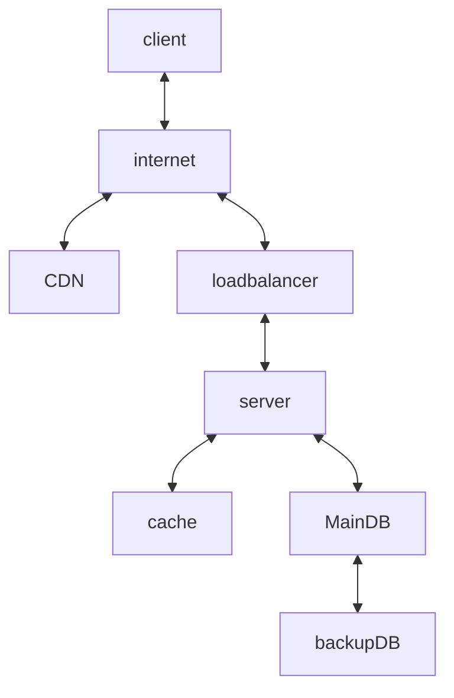

---
tags:
  - Notes
links: "[[OD Lecture 10]]"
creation date: 2024-12-28 16:26
modification date: Saturday 28th December 2024 16:26:08
semester: Break before Semester 4
year: 2024
---

---
# [[OD Lecture 10 Notes]]

---

# Client-Server Architecture  

## Overview
- Client-server architecture is a type of distributed system comprising clients and servers, where the server hosts, manages, and delivers services to clients over the internet.
- When a client needs a service, it sends a request to the server, which processes the request and sends a response back. For example, in Gmail, the web browser (client) sends HTTP requests to the mail server for actions like fetching and sending emails.
- This architecture exemplifies the separation of concerns, with the server handling heavy data processing and the client focusing on providing a user-friendly interface.

## Components of Client-Server Architecture  

- Basic client-server architecture includes four key components: client, load balancer, servers, and network protocols.
- The data flow within this architecture is unidirectional, starting with a client request to the server, which then processes the request by querying a database, returning the data to the client.
- In a simplified scenario, a client (browser) interacts with servers for information, which highlights the structured communications in this architecture.

## Types of Client-Server Architecture  

- The two-tier architecture features only a client and server, where the client directly communicates with the server, making it suitable for small applications despite inefficiencies as the application grows.
- For example, in this setup, a fast-food customer directly places an order with the cook, illustrating potential inefficiencies with increasing customers or complex orders.
- The three-tier architecture consists of a client, application server, and database server, enhancing scalability and fault tolerance for medium to large-scale applications.
- Here, the client orders through a waiter (application server), who communicates with the kitchen (database server), allowing multiple staff to better serve numerous customers.

## N-Tier Architecture  

- N-tier architecture features multiple tiers (presentation, application, data), with each tier handling specific functions and communicating to achieve tasks, making it suitable for large and complex applications.
- This model resembles a restaurant hierarchy, where a host (presentation) greets guests, a waiter (application) takes orders, and kitchen staff (data tier) prepares meals, demonstrating a well-organized operation.

## Differences Between Peer-to-Peer and Client-Server Architecture  

- The text indicates that there are significant differences between peer-to-peer and client-server architecture but does not elaborate on the specifics.

#   What are Iaas, Paas and Saas?

## Overview of IaaS, PaaS, and SaaS  

- IaaS, PaaS, and SaaS are the three primary types of cloud service offerings, often referred to as cloud service models or cloud computing service models.
- These services are not mutually exclusive; many mid-sized businesses utilize more than one, while most large enterprises use all three.
- The term 'as a service' signifies the way IT assets are consumed in these offerings, distinguishing cloud computing from traditional IT approaches.
- In traditional IT, companies buy and manage their hardware and software, whereas in cloud computing, the service provider owns and maintains the assets, which customers access via the internet.
- The main advantage of these cloud models is economic; they allow organizations to scale IT capabilities predictably and cost-effectively without the burden of maintaining on-premises infrastructure.

## infrastructure as a Service (IaaS)  

- IaaS is characterized by on-demand access to a wide array of computing infrastructure—servers, storage, and networking resources—that customers can configure and use similarly to on-premises hardware.
- With IaaS, the cloud service provider manages and maintains all hardware; customers access this infrastructure via an internet connection and pay on a subscription or pay-as-you-go basis.
- Customers can choose between virtual machines on shared hardware or dedicated bare metal servers, and they can operate these resources through web dashboards or APIs.
- Key benefits of IaaS include the ability to scale resources rapidly in response to traffic fluctuations and to avoid the costly overhead associated with maintaining on-premises data centers.
- Common uses of IaaS encompass AI readiness, application hosting, and disaster recovery. Prominent providers include Amazon Web Services, Google Cloud, IBM Cloud, and Microsoft Azure.

## Platform as a Service (PaaS)  

- PaaS provides a cloud-based platform for developing, running, and managing applications, with the service provider hosting and maintaining all necessary hardware and software.
- PaaS solutions include servers, operating systems, storage, databases, and development tools, enabling easy collaboration among development or DevOps teams throughout the application lifecycle.
- Some examples of PaaS offerings are AWS Elastic Beanstalk, Google App Engine, Microsoft Azure, and Red Hat OpenShift on IBM Cloud.
- The primary advantage of PaaS is enhanced speed and cost-effectiveness in application development compared to managing an on-premises platform.
- PaaS supports various IT initiatives, including API development, IoT application development, agile methodologies, and cloud-native strategies.

## Software as a Service (SaaS)  

- SaaS refers to cloud-hosted, ready-to-use applications accessible via web browsers, desktop clients, or mobile apps, with the vendor managing all necessary infrastructure.
- Users typically pay a subscription fee to access the application, while the vendor handles software upgrades, performance, availability, and security as detailed in a service level agreement (SLA).
- Common examples of SaaS applications include Salesforce (CRM), HubSpot (marketing), Trello (project management), and cloud storage services like Dropbox or Box.
- A significant benefit of SaaS is the elimination of the need for users to manage infrastructure or software maintenance, allowing them to focus on using the application.
- The flexibility of SaaS solutions often offers a simpler, more scalable alternative to traditional on-premises applications.

## Choosing Between IaaS, PaaS, and SaaS  

- Organizations typically choose between IaaS, PaaS, or SaaS based on the functionality they need and their internal technical expertise.
- For example, organizations lacking in-house IT for configuring servers may not benefit from IaaS, whereas those without a development team might find PaaS unnecessary.
- In scenarios where all three models could be applicable, they are often compared based on the ease of management versus the level of control relinquished.
- A hypothetical example would include a large organization aiming to implement a CRM. The choice between SaaS, PaaS, or IaaS would depend on their specific operational needs and existing resources.

# 12 factor

## Software as a Service (SaaS)  

- Software is increasingly delivered as a service, commonly referred to as web apps or software-as-a-service (SaaS).
- The twelve-factor app methodology serves as a framework for developing software-as-a-service applications.
- This methodology is applicable to applications written in any programming language and can integrate various backing services such as databases and message queues.

## Twelve-Factor App Methodology  

- The twelve-factor methodology provides best practices that help in the development and maintenance of software-as-a-service apps.
- It is derived from the cumulative experiences of contributors who have engaged with the development and deployment of hundreds of applications, particularly on the Heroku platform.
- Key focuses of the methodology include understanding the dynamics of app growth over time and the collaboration among developers, alongside strategies for mitigating software erosion.

## Key Practices of the Twelve-Factor Methodology  

- Maintain one codebase that is tracked in revision control, which can then support multiple deploys.
- Explicitly declare and isolate dependencies to create a clear operational environment.
- Store configuration information in the environment instead of hardcoding it into your codebase.
- Treat backing services, such as databases and queues, as attached resources that can be exchanged as needed.
- Strictly separate the build and run stages of an application to enhance deployment efficiency.
- Execute applications as stateless processes to achieve better scalability and resilience.
- Export services through port binding, allowing for easier integration and communication with other services.
- Scale applications out through the process model, expanding resources as demand increases.
- Maximize application robustness by ensuring fast startups and graceful shutdowns, which improve user experience and resource management.
- Keep development, staging, and production environments as similar as possible to prevent discrepancies that could lead to operational issues.
- Treat logs as event streams to facilitate monitoring and debugging.
- Run administrative or management tasks as one-off processes to maintain cleaner operational standards.