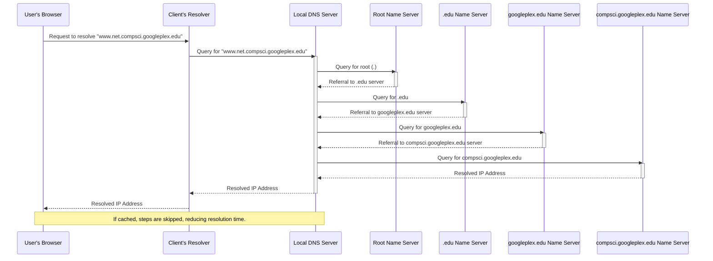
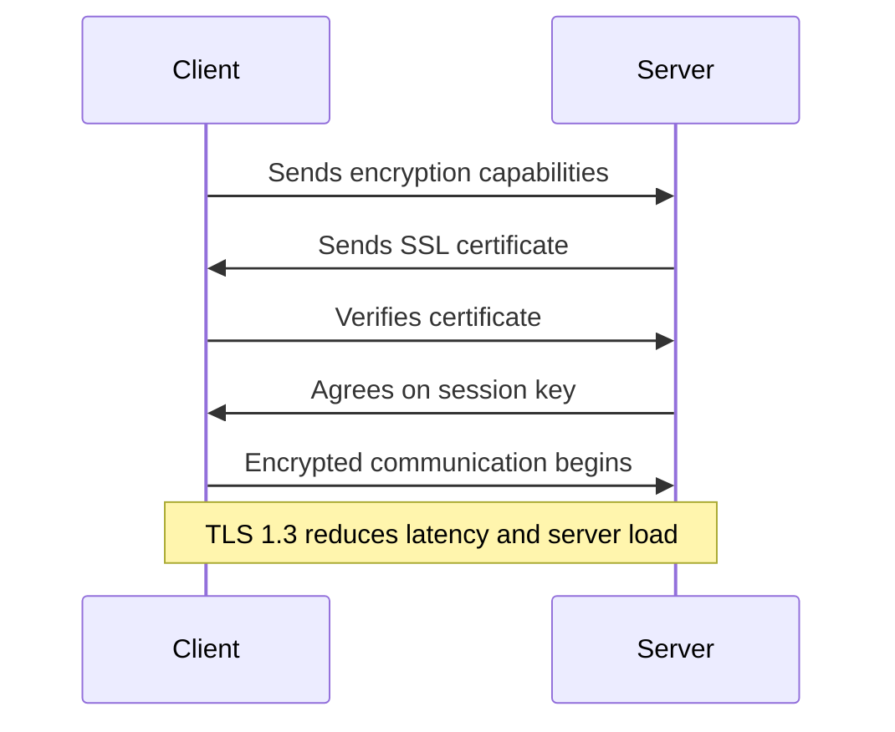

---
tags:
  - Notes
links: 
creation date: 2024-12-28 16:44
modification date: Saturday 28th December 2024 16:44:16
semester: Break before Semester 4
year: 2024
---

---
# [[OD Lecture 11 Notes]]

---

# DNS Name Resolution Process 

## Overview

- The process for resolving a DNS name involves multiple steps that are described using the example address “www.net.compsci.googleplex.edu.”
- Users initiate the resolution by typing the web address into their browser, prompting the client's resolver to request assistance from a local DNS server.
- The local DNS server performs the resolution recursively while utilizing iterative requests to access various name servers, including root, “.edu”, “googleplex.edu”, and “compsci.googleplex.edu.”
- The final step results in the local name server acquiring the IP address and passing it back through the resolver to the user's browser.
- Caching plays a vital role in enhancing efficiency; if the DNS name was previously cached, many steps in the resolution process could be bypassed, significantly reducing the time taken to access the desired resource.

# asymmetric-vs-symmetric-encryption

## Overview of Encryption  

- Encryption converts readable content (plaintext) into unreadable gibberish (ciphertext) through mathematical operations under the realm of cryptography.
- It is vital for securing communications in digital transactions, such as emails, online purchases, and sensitive data management (government, healthcare).
- There are two main types of encryption: symmetric and asymmetric, each with distinct methods and uses.

## Symmetric Encryption  

- Symmetric encryption uses a single shared secret key for both encrypting and decrypting data, making it efficient for large-scale processes.
- This method is often referred to as private key encryption, secret key encryption, or symmetric cryptography.
- Typical key lengths are 128, 192, or 256 bits, and it is favored in non-public channels due to its speed and efficiency.
- Common algorithms for symmetric encryption include DES, TDEA/3DES, and AES.
- It is widely used in applications like banking systems and data protection for large organizations.

## Asymmetric Encryption  

- Asymmetric encryption employs a pair of mathematically related keys: a public key for encryption and a private key for decryption.
- This technique is known as public key encryption, allowing secure key exchanges across untrusted channels.
- Typical key sizes are recommended at 2048 bits or greater to ensure security, making it slower than symmetric encryption.
- It plays a critical role in public key infrastructure (PKI), where it facilitates secure connections and transactions online.
- Common algorithms for asymmetric encryption include RSA, DSA, and ECC.

## Comparison of Symmetric vs Asymmetric Encryption  

- Symmetric encryption keys are identical, while asymmetric encryption uses a public and private key system, highlighting key distribution methods.
- Asymmetric keys can be exchanged freely online, whereas symmetric keys require secure offline dialogues for distribution.
- In terms of processing speed, symmetric encryption is faster and less resource-intensive, making it ideal for large data volumes.
- Asymmetric encryption allows for safe data transmission in public environments, but is slower and more complex.

# Explaining ssl handshake

## Overview of SSL/TLS Handshake  

- The SSL/TLS handshake is a crucial process for establishing secure HTTPS connections, where two parties (client and server) exchange cryptographic information.
- It performs three primary tasks: exchanging encryption capabilities, authenticating the SSL certificate, and generating a session key for encrypted communication.
- The handshake process has evolved with the introduction of TLS 1.3, which significantly reduces latency and server load compared to previous versions.

## Evolution and Importance of SSL/TLS  

- SSL/TLS certificates are essential for serving websites over HTTPS, ensuring user security and privacy in web traffic.
- The percentage of encrypted web traffic has increased from 50% in 2016 to 79% for top websites by 2019, reflecting a growing emphasis on online security.
- The protocol has undergone various enhancements, with TLS 1.3 being the latest, featuring a streamlined handshake and improved security measures.

## Key Steps of the TLS Handshake  

- The TLS handshake includes the following steps: client and server share capabilities, the server provides its SSL certificate, and the client verifies the certificate's authenticity.
- The client checks the certificate's digital signature and ensures it originates from a trusted Certificate Authority (CA).
- Finally, session keys are generated for secure data exchange, with algorithms like RSA and Diffie-Hellman being utilized for key exchange.

## Improvements in TLS 1.3  

- TLS 1.3 aims to reduce overhead associated with the handshake, moving from two round trips in TLS 1.2 to just one, effectively streamlining the process.
- It also introduces 0 RTT (Zero Round Trip Time) resumption, enhancing speed for returning users by allowing quick reconnections.
- The transition to fewer cipher suites (from 37 to 5), all requiring Perfect Forward Secrecy, reflects a shift towards simplified, more secure connections.

## Key Exchange Mechanisms  

- Asymmetric encryption methods like RSA and Diffie-Hellman are crucial for establishing secure key exchanges in the handshake, but RSA has been removed in TLS 1.3 due to efficiency concerns.
- RSA's larger key sizes (2048-bit and up) require substantial computational resources, while Diffie-Hellman is less taxing and relies on smaller elliptic curve keys.
- Diffie-Hellman combinations with digital signatures (ECDSA or RSA) are essential for authentication and key exchange during the handshake.

## Security Measures against Vulnerabilities  

- TLS 1.3 addresses past vulnerabilities associated with plaintext data during the handshake, such as downgrade attacks, by digitally signing portions of the handshake.
- The use of Authenticated Encryption with Additional Data (AEAD) ciphers in TLS 1.3 consolidates encryption and message integrity functions to increase overall security.
- Potential vulnerabilities remain, especially regarding replay attacks with 0 RTT, but the benefits of improved efficiency often outweigh these risks.

## Cipher Suites in TLS 1.3  

- Cipher suites define the algorithms used for encryption and authentication within the SSL/TLS handshake. TLS 1.2 supported 37 cipher suites, while TLS 1.3 significantly narrows this to five.
- In TLS 1.3, the first two algorithms in the cipher suite from TLS 1.2 have been eliminated, with key exchanges now predetermined as Diffie-Hellman Ephemeral-based.
- Key management and encryption have been restructured to prioritize security and performance, phasing out outdated and less effective algorithms.

# What is SSL?
- SSL, or Secure Sockets Layer, is an [encryption](https://www.cloudflare.com/learning/ssl/what-is-encryption/)-based Internet security [protocol](https://www.cloudflare.com/learning/network-layer/what-is-a-protocol/). 
- It was first developed by Netscape in 1995 for the purpose of ensuring privacy, authentication, and data integrity in Internet communications. 
- SSL is the predecessor to the modern [TLS](https://www.cloudflare.com/learning/ssl/transport-layer-security-tls/) encryption used today.
- A website that implements SSL/TLS has "[HTTPS](https://www.cloudflare.com/learning/ssl/what-is-https/)" in its URL instead of "[HTTP](https://www.cloudflare.com/learning/ddos/glossary/hypertext-transfer-protocol-http/)."

![[{6C21DC9C-BE0E-47C2-92D7-0D14EE00F6CE}.png]]

## How does SSL/TLS work?

- In order to provide a high degree of [privacy](https://www.cloudflare.com/learning/privacy/what-is-data-privacy/), SSL encrypts data that is transmitted across the web. This means that anyone who tries to intercept this data will only see a garbled mix of characters that is nearly impossible to decrypt.
- SSL initiates an **authentication** process called a [handshake](https://www.cloudflare.com/learning/ssl/what-happens-in-a-tls-handshake/) between two communicating devices to ensure that both devices are really who they claim to be.
- SSL also digitally signs data in order to provide **data integrity**, verifying that the data is not tampered with before reaching its intended recipient.

There have been several iterations of SSL, each more secure than the last. In 1999 SSL was updated to become TLS.

## Why is SSL/TLS important?

- Originally, data on the Web was transmitted in plaintext that anyone could read if they intercepted the message. 
	- For example, if a consumer visited a shopping website, placed an order, and entered their credit card number on the website, that credit card number would travel across the Internet unconcealed. 
- SSL was created to correct this problem and protect user privacy. By encrypting any data that goes between a user and a web server. 
- SSL ensures that anyone who intercepts the data can only see a scrambled mess of characters. 