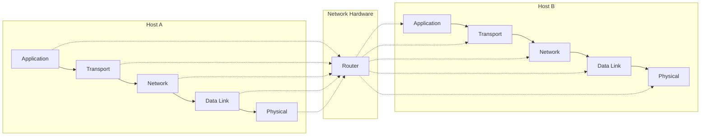
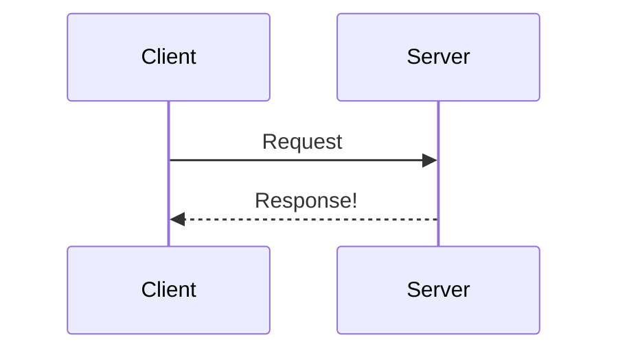
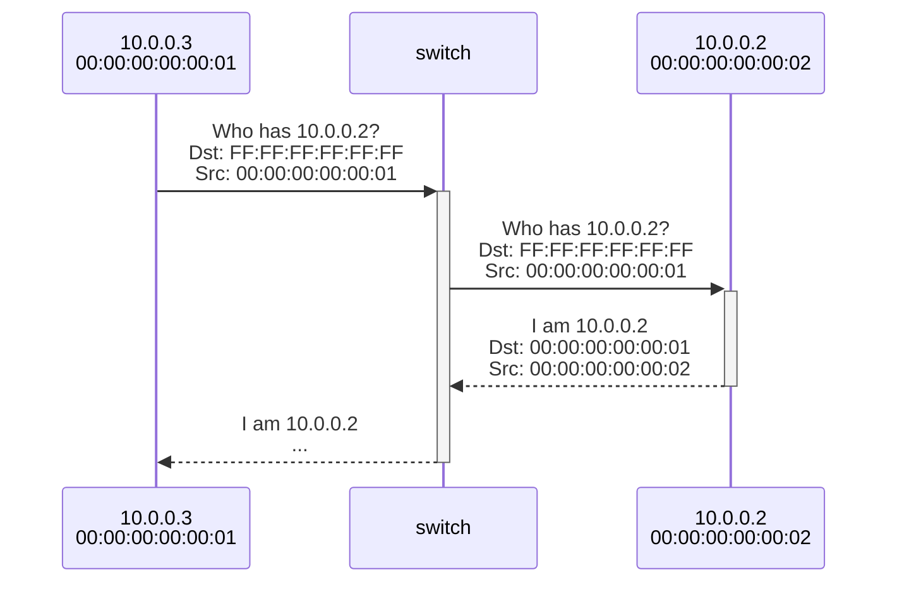
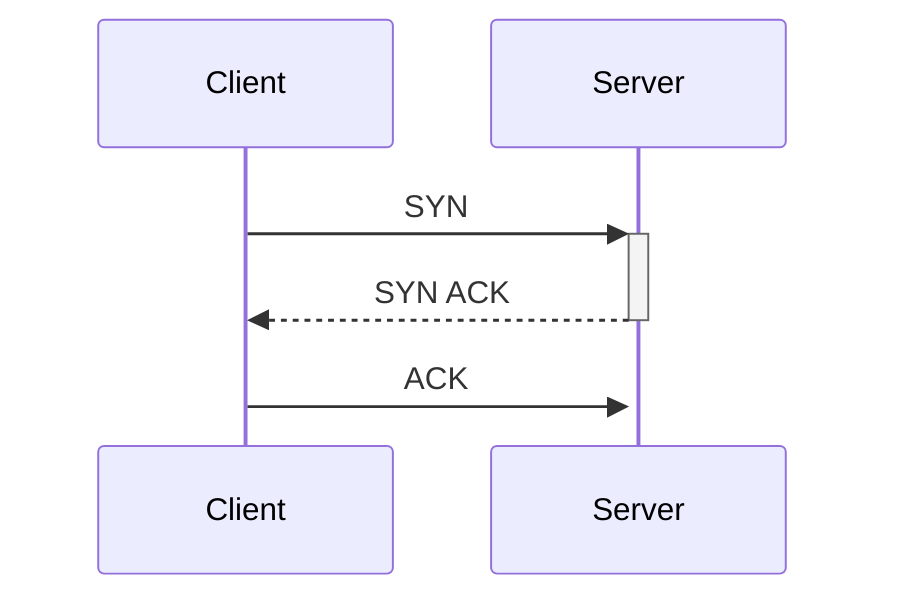
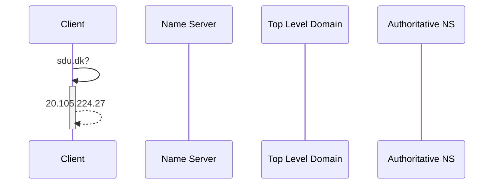
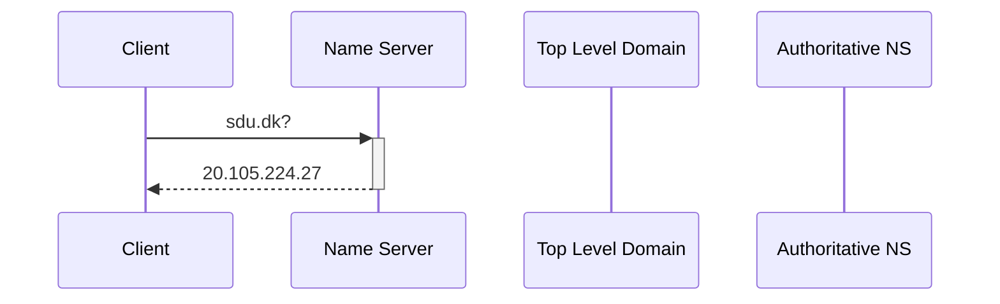
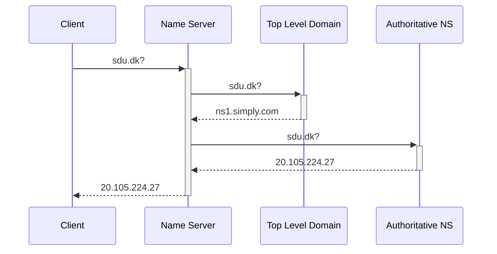
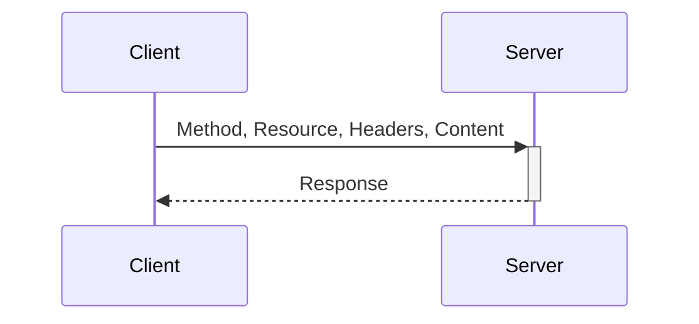
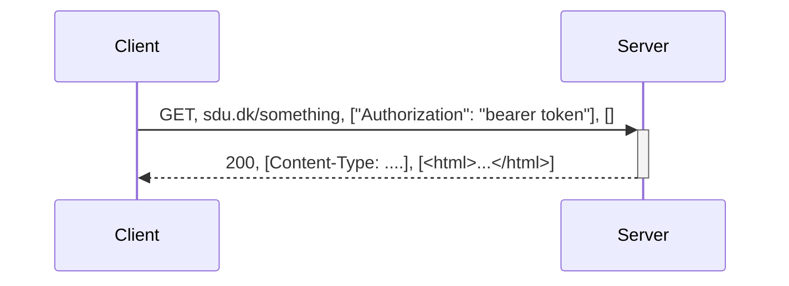

---
tags:
  - Notes
links: "[[OD Lecture 4]]"
creation date: 2024-11-09 15:27
modification date: Saturday 9th November 2024 15:27:09
semester: 3
year: 2024
---

---
# OD Lecture 4 Notes

---

# TCP/IP Model

![[Pasted image 20241004144112.png]]
# Networking Protocols Overview  

- Networking protocols are sets of rules that govern data communication and ensure reliable transmission between devices in a network.
- Key components include switches, routers, and various application-layer protocols.

# Switches  

- A switch is a networking device with multiple interfaces that connects devices within a network.
- Types of switches:
	- **Unmanaged Switch:** 
		- **Layer:** Operates at the Data Link Layer (L2).  
		- **Functionality:** Passes frames based solely on MAC addresses.
		- **Control:** Limited control over network traffic.  
		- **Use Case:** Ideal for simple networks where no advanced configuration is needed, such as home networks or small offices.
	- **Managed Switch:**  
		- **Layer:** Operates at the Network Layer (L3).  
		- **Functionality:** Forwards packets based on both IP and MAC addresses, allowing for more complex routing and management.  
		- **Control:** Offers greater control over network traffic, including features like traffic prioritization and Virtual Local Area Networks (VLANs).  
		- **Use Case:** Suitable for larger, more complex networks that require monitoring, configuration, and management capabilities.

# Routers  

- Routers are devices that connect two or more networks, managing traffic by forwarding data packets to the appropriate IP addresses.
- They allow multiple devices to utilize the same connection and use a routing table to determine the best path for data transmission.

# Data Transmission Types  

- Unicast: Sends data from one sender to one receiver.
- Multicast: Sends data from one sender to multiple specified receivers.
- Broadcast: Sends data from one sender to all possible receivers in the network.

# Sequence Diagram Client/Server

# Address Resolution Protocol (ARP)  
- ARP is a Layer 2 protocol that resolves IP addresses to MAC addresses within a local area network.
- Example Sequence:
- ARP Cache/Table maintains a list of IP addresses and their corresponding MAC addresses for quick lookup, reducing network traffic.

# Address Resolution Protocol (ARP) Layer 2

## ARP table

This table presents the address, hardware address, and interface information in a structured format.

| Address   | HWaddress         | Iface |
| --------- | ----------------- | ----- |
| 10.0.0.2  | 00:00:00:00:00:02 | eth0  |
| 10.0.0.10 | 00:00:00:00:00:0B | eth0  |

# Transmission Control Protocol (TCP) [Layer 4]

# Domain Name System (DNS) [Layer 5]

if domain already exists in registry:

if it doesn't exists in registry check in name server

text to explain this will be added later :))

# DNS Records

## Record Example Description  

This table organizes the DNS records for the domain "sdu.dk" along with their respective values, TTL (Time to Live), and descriptions.

| Record Type | Domain | Value             | TTL  | Description                       |
| ----------- | ------ | ----------------- | ---- | --------------------------------- |
| A           | sdu.dk | 10.1.1.1          | 3600 | IPv4 address of the given domain  |
| AAAA        | sdu.dk | 2313:1313:...     | 3600 | IPv6 address of the given domain  |
| CNAME       | sdu.dk | google.dk         | 3600 | Domain pointing to another domain |
| MX          | sdu.dk | 10.41.51.1        | 3600 | IP address of mail server         |
| TXT         | sdu.dk | some text         | 3600 | Arbitrary text record             |
| NS          | sdu.dk | ns.cloudflare.com | 3600 | Name server for the given domain  |
  

# HyperText Transfer Protocol (HTTP) [Layer 5]

With stuff

# Autonomous Systems (AS)

- The Internet consists of various autonomous systems, which are large networks that manage their own IP address ranges and routing policies.
- Examples of AS operators include Internet Service Providers (ISPs), tech companies, universities, and government entities.
- includes a variety of organizations, such as:  
	- **Internet Service Providers (ISPs)**: These are the companies that provide Internet access to consumers and businesses.  
	- **Tech Companies**: Large technology firms often operate their own ASes to manage their data centers and services.  
	- **Universities**: Many educational institutions maintain their own ASes to support their research and administrative functions.  
	- **Governments**: Various government entities may operate ASes for their internal networks and public services.

# Routing Protocols  
- Within ASes:
	- **Routing Information Protocol (RIP)**:
		- RIP is a distance-vector routing protocol that employs hop count as its routing metric. The hop count represents the number of routers a packet must traverse to reach its destination. The maximum number of hops allowed in RIP is 15, which limits its use in larger networks.
	- **Open Shortest Path First (OSPF)**:  
		- OSPF is a link-state routing protocol that dynamically identifies the shortest and fastest available routes by considering various factors, including the state of the links and their associated costs. OSPF is more efficient than RIP for larger and more complex networks because it uses a more sophisticated algorithm (Dijkstra’s algorithm) to calculate the best path.
- Between ASes:
	- **Border Gateway Protocol (BGP)**:  
		- BGP is the protocol used to exchange routing information between different Autonomous Systems. It is a path vector protocol that enables the announcement of which networks control specific IP address spaces and how these networks interconnect. BGP is crucial for maintaining the overall structure of the Internet, allowing for policy-based routing decisions and ensuring data packets find their way across the vast network of interconnected ASes.