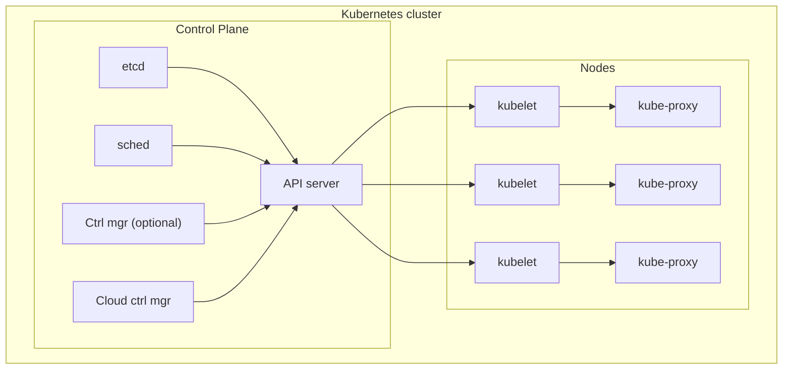

---
tags:
  - Notes
links: "[[OD Lecture 6]]"
creation date: 2024-11-09 15:45
modification date: Saturday 9th November 2024 15:45:59
semester: 3
year: 2024
---


---
# OD Lecture 6 Notes

---


# Architecture of a Kubernetes cluster




## Kubernetes Cluster Overview


- A kubernetes cluster manages containerized workloads and serrvices.
- it consits of a **Control Plane** that's responsiblle for orchestration, cluster managment and **Nodes** which is where you're applications run.
- It automates deployment, scaling, and operations, leveraging a container runtime (e.g., Docker) for underlying processes.


## Control Plane

The **Control Plane** manages the overall state of the cluster and ensures desired workloads are scheduled and run properly. It contains the following components:

- etcd
	- Key-value store that acts as the cluster's database.
	- it stores all scluster state and configuration such as deployments, nodes, and secrets
- API server
	- The **Kubernetes API Server (`kube-apiserver`)** is the centrall management compoent.
	- it exposes kubertes API's to interal and external clients
	- All interactions (e.g, commands via `kubectl`) requests from controllers, or nodes pass through the API server
- Scheduler
	- The **Scheduler (`kube-scheduler`)** determines wheree thee pods will run based on the avalliable resources and contraints
	- it interacts with the API server to get pending pods and schedules them on appropriate nodes.
- Controller Manager
	- The Controller Manager runs controllers that regulate the state of the cluster.
	- Examples of controllers inculde:
		- Replication Controller: Ensures desired pod replicas are running and if a pod dies the controller will create a new one with the same image.
		- Node Controller: Monitors node health
		- Endpoint Controller: Manages service endpoints

--- 


- Nodes
	- Nodes are the machines  (virtual or physical) where containerrrs (pods) are scheduled to run. Each node runs the following components
		- Kubelet
			- kubelet is the primary agent running on each node.
			- it communicates with the API server to:
				- Receive pod definitions
				- ensure containers are running as expected
			- it interacts with container runtimes such as Docker to start and stop containers
		- kube-proxy
			- The kube-proxy manages networking on each node.
				- it maintains network rules to:
					- Enable service discovery and routing of requests to the correct pod.
					- Ensures communication between pods and external resources.


# Container Orchestration

- Container orchestration is a system designed to manage deployment, scaling, and operations of containerized applications.
- Key functions include configuration, coordination, and the container life cycle management within a cluster that runs a container runtime, such as Docker.


# Manifest files


Kubernetes **manifest files** define the desired state of your cluster's resources (e.g., Pods, Deployments, Services) in YAML or JSON format. They are declarative and help you manage workloads consistently. Below is a breakdown of key concepts and notes to write effective Kubernetes manifest files.

## General Structure of Manifest Files

Each Kubernetes manifest file **MUST** include :
- **apiVersion**: Version of the Kubernetes API(e.g., `apps/v1`, `v1`)
- **kind**: The type of resource being created (e.g., `Pod`, `Deployment`, `Service`).
- **metadata**: Includes resource name, labels, and annotations.
- **spec**: Defines the desired state of the resource.

## Common Resource Types and Notes


- Pod
	- **Definition**: The smallest deployable unit in Kubernetes, encapsulating containers.
	- **Key Sections**:
	    - **spec.containers[]**: Define container name, image, ports, and commands.
	    - **resources**: Set CPU and memory limits/requests.
	    - **restartPolicy**: Policy for container restarts (`Always`, `OnFailure`, `Never`).


Example:

```yml
apiVersion: v1
kind: Pod
metadata:
  name: my-pod
  labels:
    app: my-app
spec:
  containers:
  - name: my-container
    image: nginx:latest
    ports:
    - containerPort: 80
```


- Deployment
	- **Definition**: Manages Pods and ensures a specified number of replicas are running.
	- **Key Sections**:
	    - **replicas**: Number of pod instances.
	    - **selector.matchLabels**: Labels to match pods for the deployment.
	    - **template**: Pod specification under the Deployment.


Example:

```yaml
apiVersion: apps/v1
kind: Deployment
metadata:
  name: my-deployment
spec:
  replicas: 3
  selector:
    matchLabels:
      app: my-app
  template:
    metadata:
      labels:
        app: my-app
    spec:
      containers:
      - name: my-container
        image: nginx:latest
        ports:
        - containerPort: 80
```


- Service
	- **Definition**: Exposes a set of pods as a network service.
	- **Types**:
	    - `ClusterIP`: Internal cluster service.
	    - `NodePort`: Exposes on each node’s IP.
	    - `LoadBalancer`: Exposes externally via cloud provider's load balancer.
	- **Key Sections**:
	    - **selector**: Labels to find target pods.
	    - **ports**: Specifies port mappings.


Example: 

```yml
apiVersion: v1
kind: Service
metadata:
  name: my-service
spec:
  selector:
    app: my-app
  ports:
    - protocol: TCP
      port: 80
      targetPort: 80
  type: ClusterIP
```


## Testing and Applying Manifest Files

- **Apply a manifest**: `kubectl apply -f <filename.yaml>`
- **Check status**: `kubectl get pods`
	- for a more detailed look: `kubectl get pods -o wide`
	- for describing a pod: `kubectl describe pod <pod name>`
- **Delete a resource**: `kubectl delete -f <file-name.yaml>`


## Networking in Kubernetes

Kubernetes networking allows communication between different components in the cluster, such as pods, services, and external clients. Kubernetes provides a **flat, cluster-wide network** model that enables communication without **Network Address Translation (NAT)**. Networking in Kubernetes is critical for application connectivity, service discovery, and traffic routing.


### Key Networking Concepts

1. **Pod-to-Pod Communication**
    
    - Each pod in Kubernetes gets its own **unique IP address**.
    - Pods can communicate with each other directly using these IPs.
    - However, pod IPs are **ephemeral** and change when a pod restarts, which makes direct communication unreliable for stable applications.
2. **Service-to-Pod Communication**
    
    - Kubernetes **Services** provide a stable way to communicate with pods.
    - A service exposes a consistent virtual IP address (ClusterIP) that routes traffic to the underlying pods.
3. **Node-to-Pod Communication**
    
    - Nodes can communicate with pods running on themselves or other nodes because of the flat network space.
4. **External-to-Internal Communication**
    
    - Kubernetes provides ways to expose internal services to external traffic using:
        - **NodePort**
        - **LoadBalancer**
        - **Ingress**