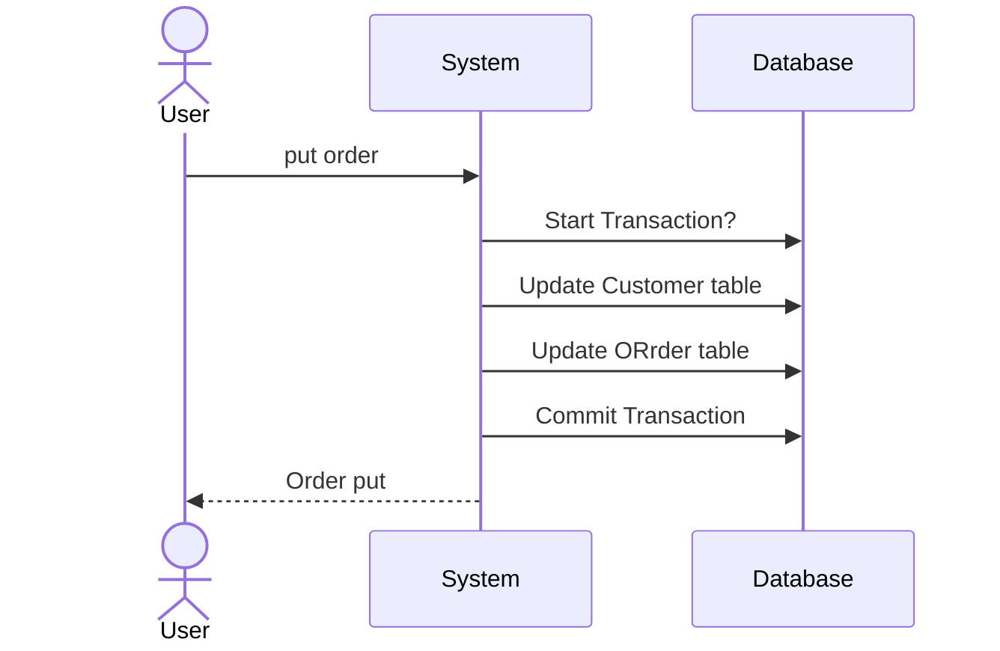
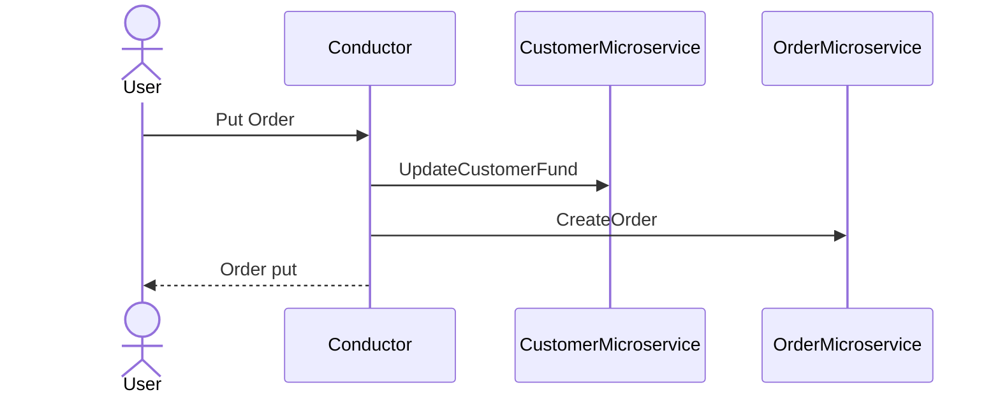
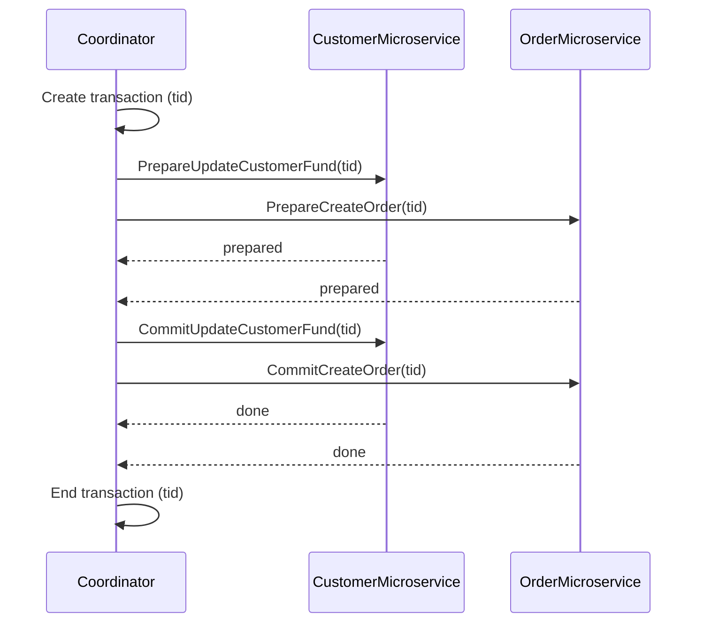
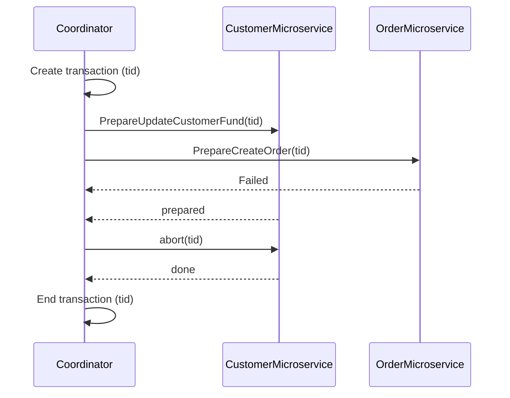
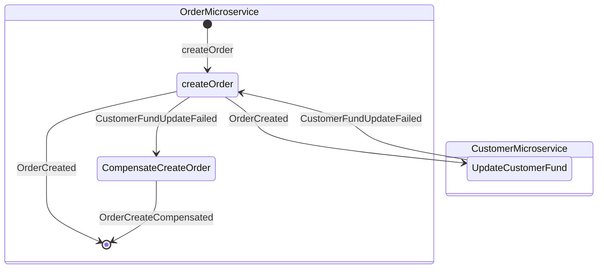

---
tags:
  - Notes
links: "[[OD Lecture 8]]"
creation date: 2024-11-22 15:31
modification date: Friday 22nd November 2024 15:31:14
semester: 3
year: 2024
---

---
# [[OD Lecture 8 Notes]]

---

## Memory Management

### Introduction to Memory Management in Operating Systems

The memory management subsystem plays a crucial role in the operating system as it enables the effective use of system memory which often exceeds physical memory limits. The key innovation in memory management is virtual memory, which creates an illusion of a larger memory space by sharing memory among processes. This not only increases the usability of physical memory but also encompasses several critical features like large address spaces, process protection, and efficient memory allocation strategies. Virtual memory is fundamental not just for memory efficiency but also for enhancing system security by isolating processes from one another.

### Key Features and Concepts of Memory Management

Virtual memory provides various essential functionalities: 1. **Large Address Spaces**: Operating systems can present a larger memory environment to applications than physically present in the system. 2. **Protection**: Each process operates within its own virtual address space, ensuring that the memory and processes do not interfere with one another. For example, memory protection allows the system to prevent rogue applications from modifying memory spaces that belong to different processes.

### Understanding Virtual Memory: An Abstract Model  

Virtual memory operates through the conversion of virtual addresses to physical addresses. The abstraction model breaks memory into standardized units known as pages. Each virtual address comprises a virtual page number and an offset, which together guide the processor to the correct physical memory through page tables.

  

### Demand Paging and Page Faults  

Demand paging is a strategic approach where the system loads pages into memory only when required by a running process. If a process accesses a virtual address not currently in memory, a page fault occurs, prompting the operating system to fetch the necessary page from disk. The operating system distinguishes between valid address accesses and invalid addresses, managing each accordingly.

  

### Swapping and Memory Strategies 

When physical memory is exhausted, the system employs a swapping mechanism where less-used pages are swapped out to make space for more critical pages. It's essential for the operating system to maintain efficiency during this process by avoiding excessive swapping, commonly referred to as thrashing.

  

### Access Control and Security 

The page tables not only track physical address mappings but also impose access controls to ensure that processes operate securely within their allocated memory regions. Access control rules ascertain what kind of operations (read, write, execute) can be performed on specific memory pages.

  

### Memory Caches and Efficiency  

To enhance performance, Linux maintains various caches including: - **Buffer Cache**: Used for block devices, it accelerates read/write operations by buffering data. - **Page Cache**: Facilitates faster access to file data. - **Swap Cache**: Prevents unnecessary writes to swap files for pages that have not changed.

  

### Page Tables and Memory Management Structures  

Linux operates with a multi-level page table structure (usually three levels), allowing efficient navigation through virtual to physical address mapping. These tables facilitate not only the address translation but also maintain the age and count of physical pages to manage allocation and deallocation effectively.

  
### Memory Mapping and Executables  

When programs or libraries are run, they are memory-mapped into the virtual address space, allowing portions to be loaded on demand. The operations associated with these memory mappings are crucial in managing the overall efficiency of process execution in Unix-like systems.

  

### Handling Page Swaps and Caching

The kernel swap daemon plays a critical role in managing the recycling of physical memory pages. It ensures that sufficient free pages are maintained, which may involve reducing the size of caches or actively swapping out shared memory pages. This intelligent management keeps the system responsive under varying workloads.

## The Linux Command Line Ch. 10

## Thread Pool Pattern

### Understanding Threads

- A thread is defined as the smallest unit of processing that can be performed by an operating system and is characterized as a lightweight process.
- In Java, a process functions as a self-contained execution environment with its own memory space and resources, while threads allow for multiple lightweight processes to execute independently or concurrently.

### Overview of Multithreading
- Multithreading enables a CPU to perform multiple processes or threads at the same time.
- This concept can be illustrated with the analogy of a one-way street converting into a four-lane highway, which allows many vehicles to travel simultaneously instead of waiting in line.

### Thread Pool Pattern

- The Thread Pool Pattern is an effective method for managing concurrent requests by efficiently handling multiple requests within resource limits.
- It reduces the overhead associated with thread creation and destruction while providing stability and performance improvements.
- In this pattern, tasks are queued and placed into a defined number of thread slots in the pool.
- For instance, with a fully utilized pool, six threads may process tasks at the same time.

## Docker Engine API

## IPC

### Inter-Process Communication (IPC) Overview

- IPC is essential for allowing processes and threads to exchange data and coordinate actions, contributing to the effectiveness, modularity, and simplicity of software systems.
- There are two main types of IPC methods: shared memory and message passing. Each has different characteristics and implementation strategies.
- A distinction is made between independent processes (unaffected by others) and cooperating processes (which can be influenced by other processes), impacting execution efficiency.

### Shared Memory Communication

- Shared memory methods involve processes sharing a common variable, which allows direct information exchange. An example involves a Producer and Consumer where they share a buffer.
- The Producer-Consumer problem demonstrates two versions: unbounded (where the producer continues without limit) and bounded (where production is restricted based on buffer size).
- Pseudo-code shows how shared memory tracks indices for produced and consumed items, implementing synchronization mechanisms such as atomic classes and mutexes to protect shared resources

### Message Passing Communication
- Message passing allows processes to communicate without shared memory, utilizing a link for message transmission that can be direct or indirect.
- Messages can vary in size (fixed or variable) and contain headers for meta-information such as message type, IDs, and control information, typically sent in a FIFO manner.
- Practical challenges include establishing communication links, managing capacities (zero, bounded, or unbounded), and determining synchronization methods (blocking or non-blocking).

### Conclusion on IPC Significance  

- Mastery of IPC mechanisms is vital for understanding modern operating systems and preparing for exams like GATE, where such topics are crucial.
- Effective synchronization ensures data consistency and resolves issues linked to concurrent processes, including race conditions.
- Overall, IPC enhances system capabilities, adaptability, and efficiency, despite its inherent complexity and potential security concerns.

## Garbage Collection in Java

### Overview
- Garbage collection (GC) in Java is an automatic memory management mechanism that deallocates unused memory.
- Programmers do not need to manually designate which objects to deallocate; this occurs automatically at the JVM level.
- The garbage collection process is conducted on low-priority threads, ensuring that the application runs smoothly while memory management occurs.
- The object lifecycle in Java involves three stages: object creation, utilization, and garbage collection.

### Garbage Collection Algorithms
- Several algorithms for garbage collection have evolved since Java's inception, including mark-sweep, mark-sweep-compact, and mark-copy.
- The mark-sweep algorithm runs in two stages: first, it identifies garbage collection roots (like local variables and static fields), then marks live objects and sweeps away unreferenced objects.
- The mark-sweep-compact algorithm adds a compacting phase, which rearranges live objects to reduce memory fragmentation.
- Mark-copy is another variation that is often referred to as deletion with copying.

### Concurrent Mark-Sweep (CMS) Garbage Collection
- CMS is an upgraded version of the mark-sweep algorithm, utilizing multiple threads to scan heap memory for unused objects.
- This method aims to minimize pauses by performing most garbage collection work concurrently with application threads.
- The CMS approach uses a parallel stop-the-world mark-copy algorithm for the Young Generation and a mostly concurrent mark-sweep in the Old Generation.
- Key configurations for CMS include setting thresholds for occupancy percentage to trigger collection cycles and enabling multiple threads for concurrent phases.

### Parallel Garbage Collector
- The Parallel Garbage Collector is designed for multi-core machines to enhance throughput and optimize system resource usage.
- It configures the number of threads for the collection process via the JVM argument `-XX:ParallelGCThreads=N`.
- As of Java 8, this garbage collector was the default choice, optimized for performance and reduced cycle times.

### Garbage-First (G1) Garbage Collector
- Introduced in Java 7, G1 was intended as the long-term replacement for the CMS collector.
- It segments the heap into small regions and collects only a subset at a time, utilizing a garbage-first approach to prioritize regions with the most garbage.
- G1’s design allows for performance goals to be set, including specific pause duration targets during garbage collection operations.
- Like other collectors, G1's compacting process also involves Stop-the-World pauses.

### JVM Arguments for Garbage Collection
- JVM arguments configure different garbage collectors; for example, CMS can be enabled with specific settings to adjust operational behavior.
- Common configurations include setting maximum heap sizes, minimum reserve percentages before triggering garbage collection, and enabling detailed logging for garbage collection events.
- These logging options can provide insights into the garbage collection process, track event timestamps, and create heap dumps in case of memory issues.

## Anatomy of a Program in Memory

### Memory Management in Operating Systems

- Memory management is fundamental to both programming and system administration, with a focus on practical aspects and internals.
- Each process in a multi-tasking operating system operates within its own memory sandbox called the virtual address space, which is a 4GB block in 32-bit mode.
- Virtual addresses are mapped to physical memory using page tables managed by the operating system kernel, ensuring separation between user processes and kernel space.
- The kernel reserves a portion of the virtual address space for its own use, which is flagged in the page tables as exclusive to privileged code.
- In Linux, kernel space is always active, mapping the same physical memory across all processes, while the user-mode mapping changes during context switches.

### Memory Layout in Linux

- A standard memory segment layout in Linux includes the stack, memory mapping segment, heap, BSS, data, and program text segments.
- The stack is where local variables and function parameters are stored, following a last-in, first-out (LIFO) design that allows for fast access.
- Each thread runs its own stack, which can expand as needed unless it reaches the maximum size, resulting in a stack overflow and subsequent segmentation fault.
- The memory mapping segment allows applications to map files directly into memory for efficient file I/O, while anonymous mappings are used for program data.
- The heap is utilized for dynamic memory allocation, with management handled jointly by the language runtime and the kernel, using system calls.

### Static Variables and Memory Segments
- The BSS segment stores contents for uninitialized static variables, while the data segment holds initialized static variables, with both areas corresponding to different physical locations in memory.
- BSS does not map to a file, whereas the data segment maps to the program’s binary and retains initial values from source code.
- Updates to the data segment do not affect the binary file due to private memory mapping.
- The program text segment, which is read-only, stores executable code, and attempting to write to this segment results in a segmentation fault.

### Dynamic Memory Management
- Dynamic memory management involves complex algorithms to efficiently handle requests based on chaotic allocation patterns.
- The time to process heap requests can be unpredictable, which is critical for real-time systems that require specialized allocators.
- Fragmentation often occurs in heaps, impacting memory usage efficiency.
- Allocation in C is handled using functions like malloc(), while higher-level languages utilize constructs like 'new' in C#.

### Security and Address Space Randomization
- Address space randomization is a security feature that prevents attackers from exploiting vulnerabilities by manipulating known memory addresses.
- Linux implements this by randomizing the stack, heap, and memory mapping segments, though the limited 32-bit address space restricts the effectiveness of this approach.

### Memory Inspection tools
- Tools such as `/proc/pid_of_process/maps` in Linux allow examination of memory areas, revealing how they are organized and utilized.
- The `nm` and `objdump` commands can be used to display symbols, addresses, and segment information about binary images.
- The flexible memory layout of Linux adapts based on stack limit configurations, while a classic layout can be reverted to when no limits are set.

## Transactions in Microservices

### What is a distributed transaction?

- A distributed transaction is a transaction that spans multiple microservices or databases, as opposed to a local transaction that operates within a single database.

Example: Customer order example with a monolithic system using a local transaction:

- In the customer order example above, if a user sends a **Put Order** action to a monolithic system, the system will create a local database transaction that works over multiple database tables. If any step fails, the transaction can **roll back**. This is known as ACID (Atomicity, Consistency, Isolation, Durability), which is guaranteed by the database system.
	- What's a monolithic system: A monolithic system is a software architecture model in which all components of an application are integrated into a single, unified codebase.
- When we decompose this system, we created both the `CustomerMicroservice`and the `OrderMicroservice`**,** which have separate databases. Here is a customer order example with microservices:

- When a **Put Order** request comes from the user, both microservices will be called to apply changes into their own database. Because the transaction is now across multiple databases, it is now considered a **distributed transaction**.

### Distributed Transactions in Microservices Architecture
- Distributed transactions become an important consideration when transitioning from monolithic systems to microservices, where multiple services may need to manage parts of a single transaction.
- A distributed transaction may involve microservices such as CustomerMicroservice and OrderMicroservice, which each have separate databases, complicating rollback procedures if part of a transaction fails.
- Challenges include maintaining atomicity, isolating user actions during concurrent requests, and ensuring successful transaction completion without a global coordinator.

### Two-Phase Commit (2pc)
- The two-phase commit protocol (2pc) consists of a prepare phase and a commit phase, used to manage distributed transactions across microservices.
- In the prepare phase, all participating microservices are asked to prepare for a data change; the commit phase follows if all microservices are ready to apply changes.
- If any microservice is unable to prepare, the coordinator aborts the transaction and initiates rollback processes.
- Although 2pc guarantees strong consistency, its synchronous nature can introduce performance bottlenecks, as it locks data and can lead to deadlocks in high-frequency transaction scenarios.

Here is a 2pc implementation for the customer order example:

If at any point a single microservice fails to prepare, the `Coordinator` will abort the transaction and begin the rollback process. Here is a diagram of a 2pc rollback for the customer order example:

- In the above example, the `CustomerMicroservice` failed to prepare for some reason, but the `OrderMicroservice` has replied that it is prepared to create the order. The `Coordinator` will request an abort on the `OrderMicroservice` with the transaction and the `OrderMicroservice` will then roll back any changes made and unlock the database objects.

### Saga pattern

- The Saga pattern offers an alternative to 2pc by enabling asynchronous and reactive management of distributed transactions through local transactions in an event-driven manner.
- Microservices within a Saga communicate via an event bus, with one service emitting an event that others can listen to for updates and actions—promoting parallel processing without locking resources.
- A notable drawback of the Saga pattern is the difficulty in debugging, particularly with complex systems, and challenges in maintaining event messages.
- Unlike 2pc, the Saga pattern lacks read isolation, allowing for temporary data visibility during ongoing transactions, complicating user experiences.
- The implementation of a process manager can help orchestrate events and responses between services, but adopting the Saga pattern requires a shift in both development and testing methodologies.

- In the above example, the `UpdateCustomerFund` failed for some reason and it then emitted a `CustomerFundUpdateFailed` event. The `OrderMicroservice` listens for the event and start its compensation transaction to revert the order that was created.

