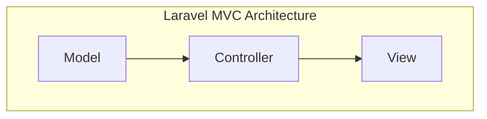

---
tags:
  - Notes
links: 
creation date: 2025-01-06 17:14
modification date: Monday 6th January 2025 17:14:34
semester: Break before Semester 4
year: 2025
---


---
# [[Web tech Lecture 6 Notes]]

---


## Laravel Database Migrations  

- Laravel facilitates the creation of database tables through migrations, which is a recommended method for managing database structure.
- To create a new table, the command used is `php artisan make:migration create_albums_table --create=albums`. For updating an existing table, use `php artisan make:migration add_desc_to_albums_table --table=albums`.
- Migration files are named in the format `yyyy-mm-dd-time_name_of_file.php` (e.g., `2021_09_27_194155_create_albums_table.php`) and are executed in chronological order.
- The `up()` function is used to apply migrations, while the `down()` function is used to roll back changes.
- Important schema functions include `integer(name)`, `string(name)`, `boolean(name)`, `datetime(name)`, and `foreign(name)` for defining foreign keys. For example, to add a foreign key for an artist, you would use `$table->unsignedBigInteger('artist_id'); $table->foreign('artist_id')->references('id')->on('artists')->onDelete('cascade');`.


## Laravel MVC Architecture


- In the Laravel MVC architecture, the Model represents data and business logic, the View handles graphical/textual output, and the Controller manages user inputs and communication among models and views.
- Laravel employs the Eloquent ORM (Object-Relational Mapping) design pattern, which automates the process of connecting models to the database and reducing the need for raw SQL queries.
- Models are created using the command `php artisan make:model Album`, and these models directly map to database tables, simplifying data interactions.
- The models in Laravel do not need to define instance variables explicitly, as attributes are retrieved from the database's columns.
- Common database interaction methods in Eloquent include `::all()`, `::where(key, value)`, and `::orderBy(key, 'desc')`, among others.




##  Working with Eloquent Models  

- To save new records, you can instantiate a model, set its properties, and invoke the `save()` method. Example:
- To update existing records, find the model by its ID and assign new values before saving:
- For mass assignment, define either `protected $fillable` or `protected $guarded` properties within the model to secure data handling. Example: `protected $fillable = ['title', 'description'];`.
- You can also create or retrieve a record conditionally with methods like `firstOrCreate([...])`, which attempts to find a record and creates it if it doesn't exist.
- To remove records, various methods exist such as `$album->delete();` for specific entries or `Album::where(...)->delete();` to delete based on conditions.


## Eloquent Relationships  

- Eloquent allows the definition of relationships through methods in models. For example, an `Album` model can reference an `Artist` model by defining `public function artist() { return $this->belongsTo(Artist::class); }`.
- There are several relationship types, including `belongsTo()`, `hasOne()`, `hasMany()`, and for many-to-many relationships, a pivot table should be used for associations.
- A common pivot table naming convention is to concatenate and alphabetize the two singular model names, such as `album_artist`.
- To associate models in a relationship, use methods like `$album->artist()->associate($artist);`.
- Fetching related records can be done directly through relationships, such as calling `$album->artist` or chaining queries for more specific criteria.


## Examples

### Database Migrations

Migrations are a crucial aspect of managing your database schema in Laravel. Here are some examples:

#### Creating a Migration

To create a new migration for an

```plaintext
albums
```

table:

```plaintext
php artisan make:migration create_albums_table --create=albums
```

#### Updating a Migration

To add a new column to the

```plaintext
albums
```

table:

```plaintext
php artisan make:migration add_desc_to_albums_table --table=albums
```

#### Migration File Structure

A migration file typically follows this naming convention:

```plaintext
yyyy_mm_dd_time_name_of_file.php
```

For example:

```plaintext
2021_09_27_194155_create_albums_table.php
```

#### Migration Functions

Here’s how to define the

```plaintext
up
```

and

```plaintext
down
```

methods in a migration:

```php
public function up() {
    Schema::create('albums', function (Blueprint $table) {
        $table->id();
        $table->timestamps();
        // Add additional columns here
    });
}

public function down() {
    Schema::dropIfExists('albums');
}
```

### 2. Eloquent ORM

Eloquent is Laravel's built-in ORM (Object Relational Mapping) that simplifies database interactions.

#### Creating a Model

To create a model for

```plaintext
Album
```

:

```plaintext
php artisan make:model Album
```

#### Common Eloquent Methods

Here are some common methods you can use with Eloquent models:

- **Retrieve All Records**:
    
    ```php
    $albums = Album::all();
    ```
    
- **Find a Record by ID**:
    
    ```php
    $album = Album::find($id);
    ```
    
- **Conditional Queries**:
    
    ```php
    $albums = Album::where('artist_id', $artistId)->get();
    ```
    
- **Update a Record**:
    
    ```php
    $album = Album::find($id);
    $album->title = 'New Title';
    $album->save();
    ```
    
- **Delete a Record**:
    
    ```php
    $album = Album::find($id);
    $album->delete();
    ```
    

### 3. Relationships in Eloquent

Defining relationships between models is essential for working with related data.

#### One-to-Many Relationship

For an

```plaintext
Album
```

that belongs to an

```plaintext
Artist
```

:

```php
class Album extends Model {
    public function artist() {
        return $this->belongsTo(Artist::class);
    }
}
```

#### Many-to-Many Relationship

For a many-to-many relationship, use a pivot table:

```php
class Album extends Model {
    public function artists() {
        return $this->belongsToMany(Artist::class);
    }
}
```

### 4. Routing with Controllers

You can define routes that utilize Eloquent models directly. For example:

```php
Route::get('albums/{id}', function ($id) {
    $album = Album::findOrFail($id);
    return view('albums.show')->with('album', $album);
});
```

### 5. Best Practices

- **Keep Model Logic in Controllers**: Avoid placing database interaction code directly in views.
    
- **Mass Assignment Protection**: Define
    
    ```php
    $fillable
    ```
    
    or
    
    ```php
    $guarded
    ```
    
    properties in your models to protect against mass assignment vulnerabilities.
    

```php
class Album extends Model {
    protected $fillable = ['title', 'artist_id', 'description'];
}
```
